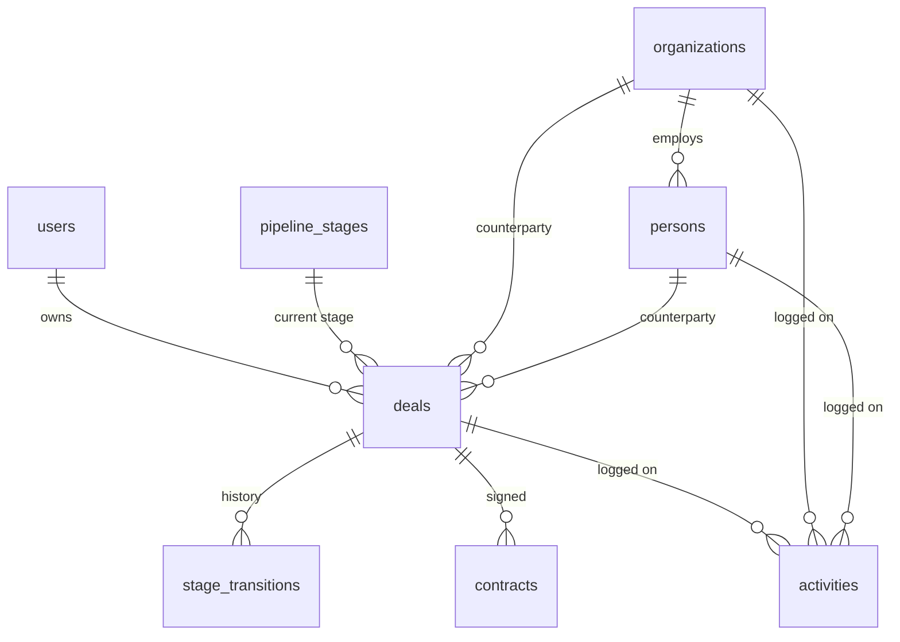

# YunoCRM v2

A hand-kept CRM for a company that sells SaaS: organizations, people, deals, activities and contracts, all entered through forms. No automation, no AI, no ingestion - every record exists because someone typed it.

Next.js 16 (App Router) · TypeScript · Tailwind v4 · Supabase (Postgres + Auth) · deployed on Vercel.

## Live

- App: https://yuno-ai-crm.vercel.app
- Database credentials are sent separately by email. Nothing in this repo contains them; `.env.local` is gitignored.

## Test accounts

| Email | Password | Role |
| --- | --- | --- |
| camillo@yunocrm.test | `YUQLQTKcf63eCQKTnw` | admin |
| anna@yunocrm.test | `4gsX2s5Lx6kAVfjNTk` | member |
| marco@yunocrm.test | `VuEDKSwiTunTnCwY87` | member |
| giulia@yunocrm.test | `mSQfAufnedzg37QTi9` | member |

These are demo accounts on a demo database; the passwords are checked in deliberately so the app is reviewable without a separate handover.

To compare the two views, open **Settings**. An admin manages the pipeline stages (add, rename, reorder, delete) and each teammate's role; a member sees the team roster read-only and no pipeline card at all. Everything else — deals, contacts, activities, contracts — is shared: any signed-in user can read and edit any record, which is the intended model for a team this size. The one exception is editing a recorded contract: anyone can create one, but corrections are admin-only — a signed amount is bookkeeping, and rewriting it is an accountable act (enforced in the UI, the action and an RLS policy).

## Running locally

```bash
npm install
cp .env.example .env.local
```

Fill `.env.local` with four values from your Supabase project — `SUPABASE_URL`, `SUPABASE_PUBLISHABLE_KEY`, `SUPABASE_SECRET_KEY`, `DATABASE_URL`. `.env.example` says where each one lives in the dashboard.

```bash
npx supabase db push --db-url "$DATABASE_URL"   # schema
npm run seed:users                              # the four accounts above
npm run seed:demo                               # demo records
npm run dev                                     # http://localhost:3200
```

`seed:demo` wipes the demo tables and rewrites them, so it doubles as the reset command. It does not touch accounts.

```bash
npm test         # vitest, no database or network needed
npm run lint
npm run typecheck
```

The tests cover the rules that can be wrong without looking wrong: deal sorting and filtering, urgent-first ordering, money and date formatting, role parsing. Queries are not mocked — a test asserting that PostgREST was called the way the test expects would restate the implementation rather than check it, and the invariants that matter are CHECK constraints in the database.

## Data model



| Table | Why it exists |
| --- | --- |
| `users` | App profile for a Supabase Auth account — display name and role. Auth owns the credentials; this owns who the person is inside the CRM. |
| `pipeline_stages` | The configurable stages of the sales process, ordered by `position`. |
| `organizations` | Companies you sell to. |
| `persons` | Individuals, each optionally employed by an organization. |
| `deals` | An opportunity: value, expected close, current stage, and open/won/lost. |
| `stage_transitions` | Append-only log of every stage change on a deal, with who moved it and when. |
| `activities` | Calls, meetings, emails, tasks and notes, attached to a deal, a person or a company. |
| `contracts` | What was actually signed against a deal — date, value, terms. |

## Key decisions

- **Stages are a table, not an enum.** Stages are configuration the team reorders and renames, so deals store a `stage_id`. Renaming "Proposal" or moving it in the funnel touches one row and leaves every deal and every history entry alone.

- **`stage_transitions` is append-only history.** A deal's current stage says where it is; the log says how it got there. Without it "how long do deals sit in Proposal" has no answer, because the previous stage is overwritten on every move.

- **One `activities` table for past and future.** A logged call and a scheduled call are the same entity in different time states — same fields, same links, same list. Splitting them into two tables would duplicate the schema to express a `done` flag.

- **Contracts are their own table, not `status = 'won'`.** A contract carries data a deal does not — signing date, signed value, terms — and one deal can produce more than one. Winning a deal and signing a contract are separate events, so they are separate rows.

- **Constraints live in the database.** `lost_reason` is required when a deal is lost and must be empty otherwise; a deal must point to at least an organization or a person; an activity must be linked to at least one record. Enforced by CHECK constraints, so a bug in the app or a hand-written SQL statement cannot write a contradictory row.

## Demo data

The database ships populated — 6 organizations, 10 people, 12 deals, 13 activities, 2 contracts — so every screen has something in it. The edge states are seeded too: one deal is won and one is lost with a recorded reason, one deal has a person but no company, and two activities are flagged urgent.

Run `npm run seed:demo` to reset to exactly that set.

## Deliberately out of scope

- **Kanban board for the pipeline.** The stage stepper on a deal already moves a deal and records the transition; a board is a second way to do the same write.
- **Multiple participants per activity.** One activity links to one deal, one person, one company. Attendee lists are a join table serving a reporting question nobody asked yet.
- **Geolocation fields on organizations.** Addresses are stored as text. Coordinates only pay off with a map or a territory query, neither of which exists here.
- **File uploads on contracts.** Excluded by instruction. Contracts record the terms, not the PDF.
